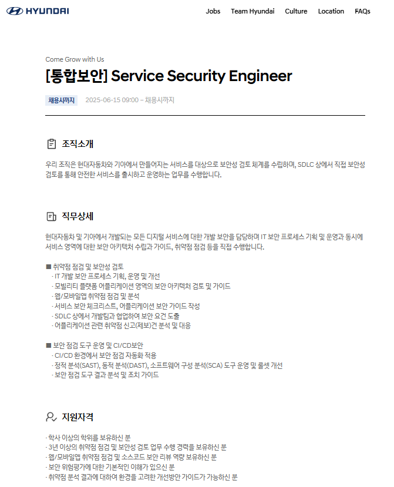
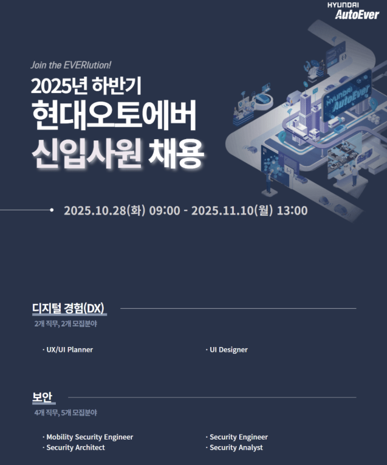
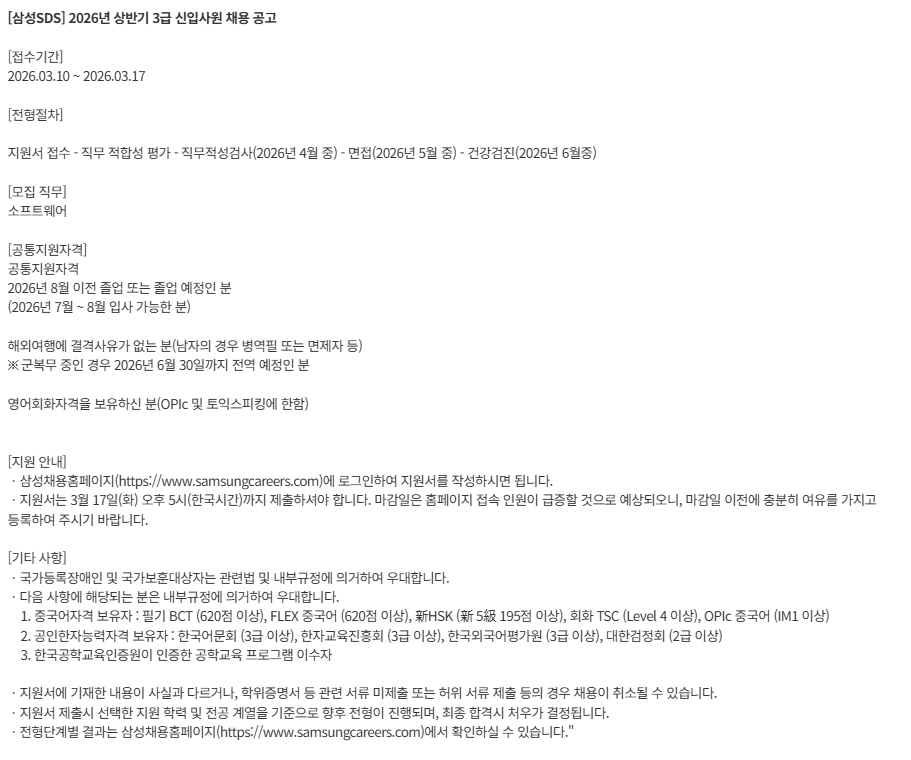
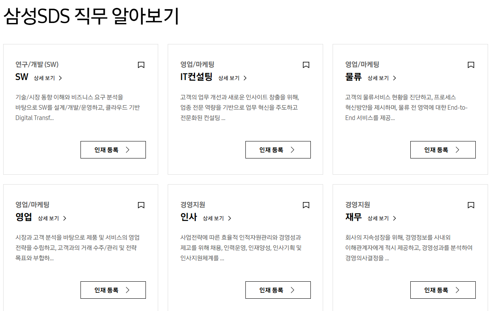
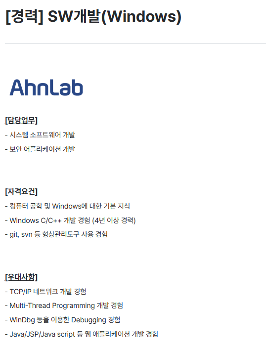
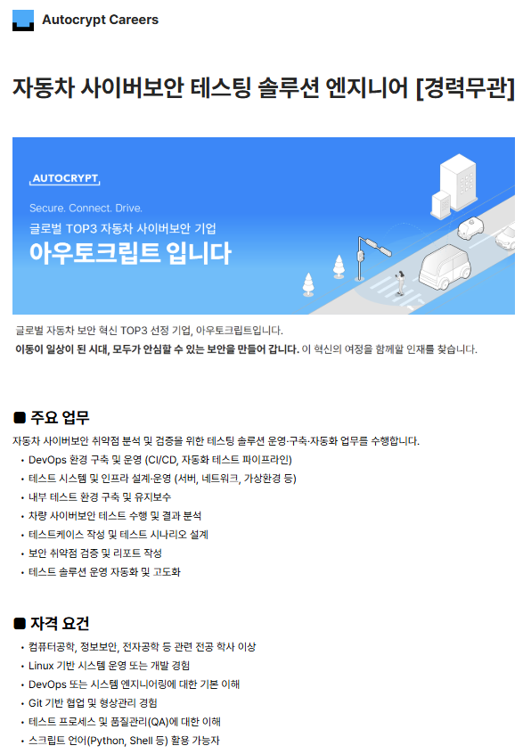

---
### 1. 진로에서 중요한 가치와 우선순위
연봉과 워라벨을 가장 중요하게 여기고 
회사 인지도와 안정성은 우선순위가 낮다 

### 2. 시장분석
#### (1) 희망 회사
삼성SDS, 현대자동차, 안랩

#### (2) 희망 직무 및 관련 공고
##### 현대자동차
현재 진행 중인 공고이다.
{: .align-center}
[통합보안/Service Security Engineer](https://talent.hyundai.com/apply/applyView.hc?recuYy=2025&recuType=N2&recuCls=245)
지원자격을 보면 3년 이상의 취약점 점검 및 보안성 검토 업무 수행 경력과 웹/모바일앱 취약점 점검 및 소스코드 보안 리뷰 역량을 요구한다. 
우대사항으로는 대규모 IT서비스(웹/모바일앱) 도메인에서 취약점 점검 및 보안성 검토, 
인증(AuthN) 보안 설계 및 어뷰징 대응, 프로그래밍 언어를 활용한 SW 개발, 
국내외 해킹대회 수상 경력자 및 버그바운티 신고 포상자로 선정된 경험을 보유한 사람을 원한다. 

##### 현대오토에버 
현재 채용 진행중이지만 개발자 위주로 뽑는거 같아서 작년 링커리어 공고를 확인했다.
{: .align-center}
[현대오토에버/2025년 하반기 신입사원 채용](https://linkareer.com/activity/277943)
보안 관련 업무로는 Mobility Security Engineer_차량보안진단, Security Engineer_엔드포인트 보안시스템 운영관리, 
Security Architect_보안 신기술 발굴/검증 및 사업화 전략, Security Architect_보안 서비스 및 상품 기획 부문에서 모집했다. 
우대사항을 확인할 수 없지만 해당 분야의 실무 경험이 요구될 것으로 예상된다.  

현대오토에버 재직자의 이야기를 볼 수 있는 people 페이지에서 직무에 대해 알아볼 수 있다. 
[현대오토에버 구성원의 이야기](https://career.hyundai-autoever.com/ko/people)

##### 삼성SDS 
삼성SDS는 현재 진행중인 채용공고가 없어 지난달 공고와 삼성커리어 페이지를 찾아보았다.
{: .align-center}
[삼성SDS/2026년 상반기 3급 신입사원 채용 공고](https://linkareer.com/activity/307288)
{: .align-center}
[삼성커리어_SDS](https://www.samsungcareers.com/subsid/detail/C60)
연구 및 개발 분야에서 원하는 역량은 프로그래밍 언어를 이해 및 알고리즘 문제 해결 역량과 요구사항 이해 및 코드 구현이었다.  

##### 안랩
보안 전문 회사라 여러 분야의 보안 직군을 확인할 수 있다. 
아직 관심분야를 정하지 못했지만 SW개발(Windows) 공고를 확인해보았다.
{: .align-center}
[AhnLab/경력_SW개발(Windows)](https://ahnlab.recruiter.co.kr/career/jobs/99908)
신입은 클라우드 개발만 뽑고 나머지는 다 경력이다 
자격요건을 보면 컴퓨터 공학 및 윈도우에 대한 기본 지식과 4년 이상의 개발 경력을 본다. 

##### 아우토크립트 
아우토크립트는 자동차 사이버보안 기업이다. 완전한 자율주행 자동차 시대가 온다면 보안직군이 필수요소이기에 찾아보았다. 
다양한 채용 모집 직군 중 경력직이 많았지만 난 아직 경력이 없으므로 경력무관 중 테스팅 솔루션 엔지니어를 확인했다.
{: .align-center}
[아우토크립트/자동차 사이버보안 테스팅 솔루션 엔지니어_경력무관](https://autocrypt.career.greetinghr.com/ko/o/139647)
자동차 ​사이버보안 ​취약점 분석 ​및 검증을 위한 테스팅 ​솔루션 ​운영·구축·자동화 업무를 ​수행하는 업무이다. 
Linux 기반 시스템 운영 또는 개발 경험, DevOps 또는 시스템 엔지니어링에 대한 기본 이해,
Git 기반 협업 및 형상관리 경험, 스크립트 언어(Python, Shell 등) 활용 등에 대한 자격 요건을 본다. 

#### (3) 필요한 역량
공고 5개에서 모두 다 해당 직무에 대한 **경력**을 원한다!!! 
하지만 난 아직 경력이 없으므로 내가 어떤 역량을 키우면 좋을지 생각해보았다. 
1. 개발 및 보안 역량으로 코드를 이해하고 작성할 수 있는 능력 
2. 취약점 분석 및 보안 점검 역량으로 서비스의 보안 문제를 분석하는 능력 
3. 시스템 및 인프라에 대한 이해로 운영 환경(Linux, 네트워크 등)에 대한 기본 지식 
따라서 C 언어에서 발생하는 취약점 코드를 이해하고 방어하는 방법을 공부하려 한다.
